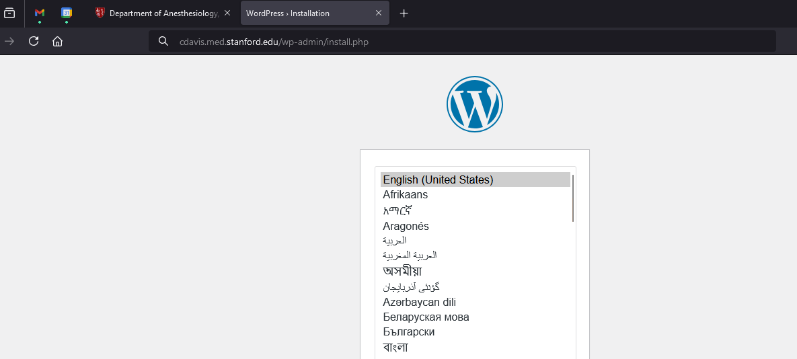
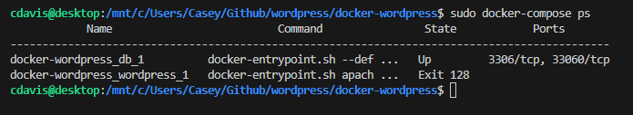

## Docker Compose Wordpress using Ubuntu/Nginx/Mariadb

Here is a quick docker compose script to install Wordpress on my local machine

Installs
- MariaDB
- Nginx
- PHP
- Wordpress latest

Dependencies
docker
docker-compose

1. Install my cloning repository to your workstation
2. Change to the directory
    cd /docker-wordpress
3. Run docker compose command
    docker-compose up -d
4. Dependencies are downloaded and container is created
5. Monitor using docker-compose
    docker-compose ps

